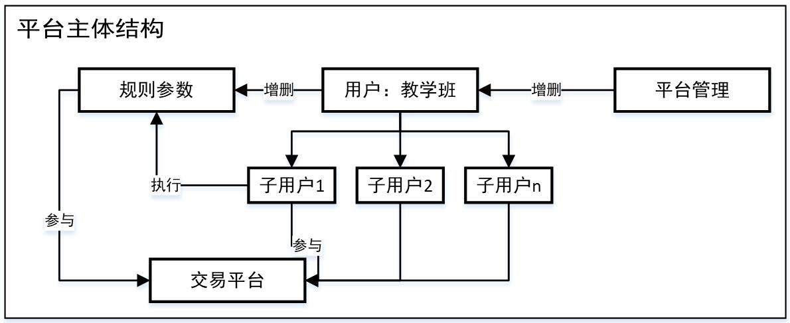
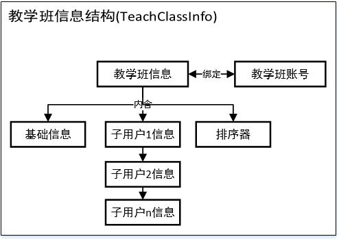
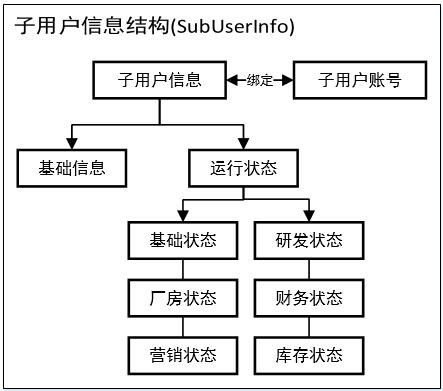
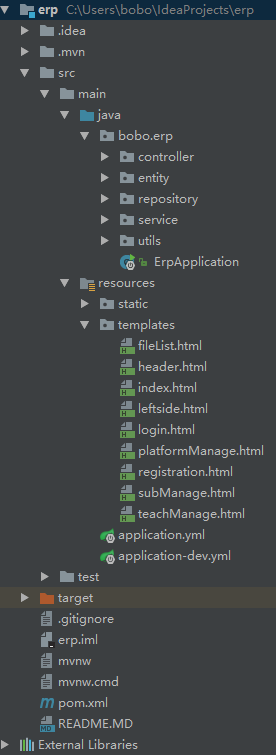

title: 探索ERP系列(二) ERP沙盘是如何运行起来的
date: 2017-09-12 12:06:53
tags:
---
在上一篇文章里面，给大家介绍了这个ERP沙盘平台运行起来是什么样子的，那么接着在这篇文章里面将给大家介绍平台背后的运行原理。 

首先结合上一篇文章，先简单介绍界面设计对应的后台结构。
--
在搭建这个平台的时候，我选择了从上到下的设计开发方式，即先设计开发顶层的**平台管理**，再逐步设计开发**教学班**和**子用户**。 
平台管理所承担的主要业务是**教学班的增删、各类用户信息查询**以及规则市场的增删。（一般只进行前两类操作，规则市场的增删一般由各教学班进行） 
<!-- more -->
 
规则和市场作为平台管理的部分，也是在同一阶段完成设计开发的，具体细节将在稍后解释项目目录时再作介绍。  
接下来我们看一下**教学班信息结构**(TeachClassInfo,简称thc)，要留意的是**教学班信息与教学班账号是两个不同的组件**：教学班信息主要用于记录教学班的基础信息、排序器(用于选单)、全部子用户的信息；而教学班账号则是用于识别用户身份，登录后分发至指定页面。 
教学班在初始化时的设置，会记录至**基础信息**这个部分里面。如子用户数量、调用的规则ID和市场ID、运行时间、选单会和竞单会状态等。 
教学班在初始化后，根据设定的子用户数量，会生成同样数量的子用户信息。 。
  
然后我们来**观察子用户信息结构**(SubUserInfo,sub)，同样的**子用户信息与子用户账号也是两个不同的组件**。 
在子用户信息中，**基础信息**部分较为简单，只有subUserName这一个属性(教学班初始化时设置与用户的username相同)。 
**运行状态**(RunningState)是子用户信息中的重要部分，每个子用户信息中均含有一个运行状态。 
运行状态呈树状展开，RunningState为**第一层**； 
**第二层**有基础状态(BaseState)、研发状态(DevState)、厂房状态(FactoryState)、财务状态(FinanceState)、营销状态(MarketingState)、库存状态(StockState)； 
第三层由于数量较多，在此不作介绍。 
  
对于后台的主体结构就介绍到这里。教学班/子用户的信息与账号之间的绑定也会在稍后作详细介绍。  

项目目录和MVC的简介
--
**MVC**，可以理解成 **View** <---> **Controller** <---> **Model** 。 
View是用户界面。Model是业务处理模型，提供业务处理实现的所有接口，比如登录请求，数据校验等。Controller是View和Model的桥接，将View的输入传递到Model，并将Model的结果反馈到View。 
以上一篇文章中的的**申请短贷**为例。学生端页面即View，用户输入贷款金额并点击申请后所发生的事情：**View通过Ajax向后台发出一个POST请求**(url: "/operateApplyDebt/nowUserName")，**Controller接收到该请求，并将数据**(用户名、贷款额、贷款类型)**传递至指定的Modal进行处理**(提取runningState、核验贷款额度、将贷款记录保存至数据库，更改现金数额等)，**Modal将处理后的runningState返回至Controller**，**并由Controller返回其至View**。  
为了能更深入的探索这个平台(看代码)，我们需要对项目的目录有一个大致的了解。 
 
(没有下载到代码的话，在Github的[项目首页](https://github.com/cainsyake/erp)也是能看代码的。)  
后端代码主要位于**src.main.java.bobo.erp**中； 
前端代码主要位于**src.main.resources**中。  
后端代码根据不同作用，被放置于各个不同的**包**(Package)中： 
**controller**：Controller类(MVC中的C)，对接收到的请求进行分发。 
**entity**：实体类(Entity)，存放各类对象的数据结构。 
**repository**：JPA接口(Interface)，对数据库进行查询。 
**service**：业务处理类((MVC中的M))，对业务进行处理。 
**utils**：工具类，提供常用工具类。 
**ErpApplication**：启动类  
**Springboot框架**中自带Web Server，运行启动类后可以直接把应用打包成为一个jar/war，然后这个jar/war是可以直接启动的，不需要另外配置一个Web Server。 
本项目是典型的**Springboot**项目，更多有关Springboot的信息[请点此](http://projects.spring.io/spring-boot/)  
前端代码目录及其说明： 
**templates**：页面模板(MVC中的V)，这个项目使用了**thymeleaf**作为**模板引擎**。 
**stati**c：静态文件，当前开发一般只操作js文件，可以留意**erp-sub.js**和**erp-thc.js**这两个文件。  
这次对于后台的简介就到这里了，感谢你的阅览，接下来的一篇文章将是对业务处理的深入探索(后端)，请留意[Github项目](https://github.com/cainsyake/erp)的更新。  