首先要对账号的类型做一个简单的介绍，账号分为3种类型：**管理员、教师(教学班)、学生(子用户)**，不同类型的账号登陆后将会被分发至不同的页面。下面我们将依次介绍三个用户界面。  
我们首先登录一个**管理员**的账号，看一下登陆后是什么样子的。 
<!-- more -->
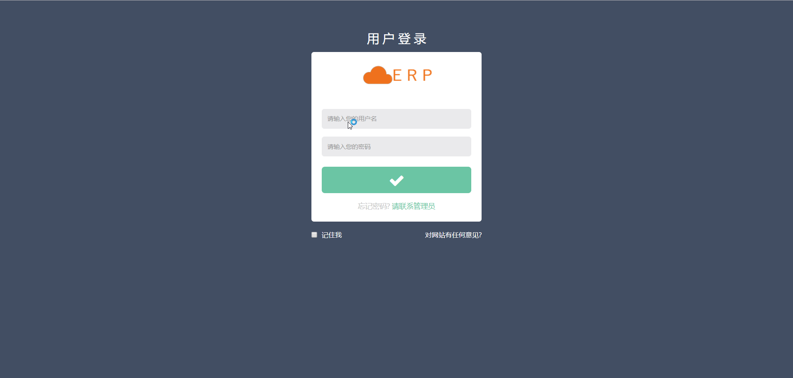
  
页面中部是操作区和编辑区， 
操作区第一行按钮主要是对各类**用户（管理员、教师、学生）进行的增删改操作**。 
操作区第二行按钮主要是对**规则和市场**进行操作。 
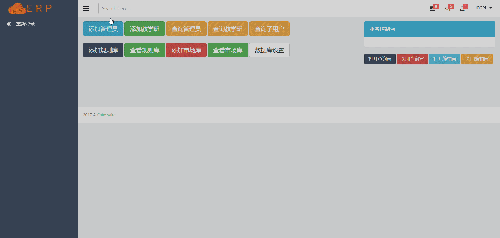  
编辑区主要是对规则进行编辑，查看规则和市场。 
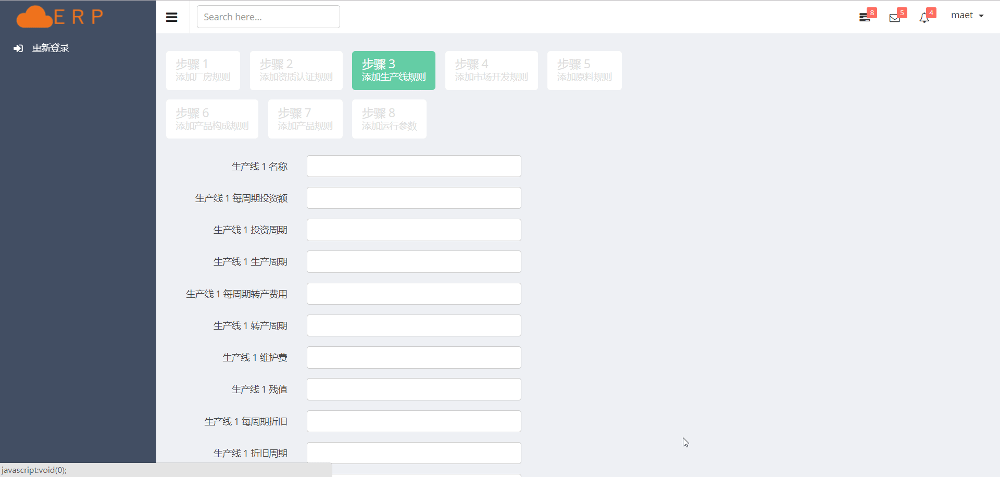 
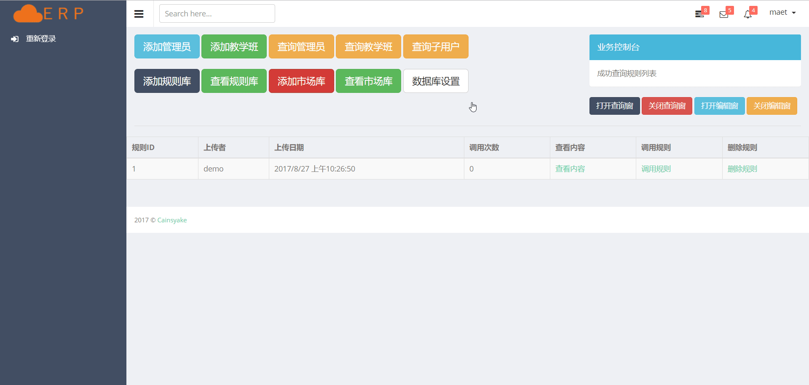 
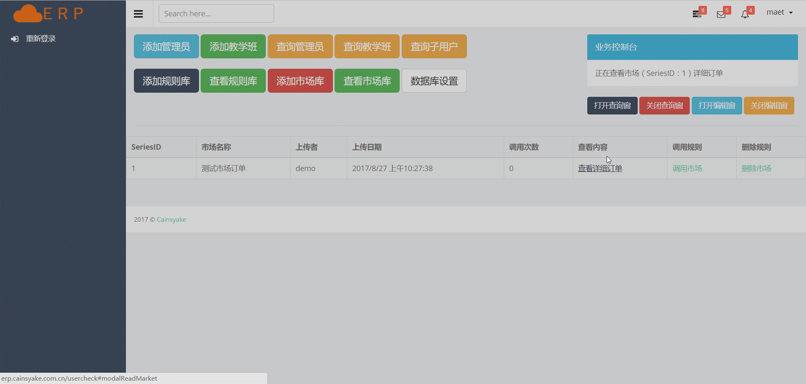 
页面右上方是业务控制台，用以显示操作记录和后台返回的信息。  

接着我们来登录一个创建好的**教师**账号的 
和管理端相似，教师端的中部也是操作区和编辑区，不同的是教师端的操作区按钮要更多一点。 
操作区第一行按钮主要是对整个**教学班的初始化、还原操作**。 
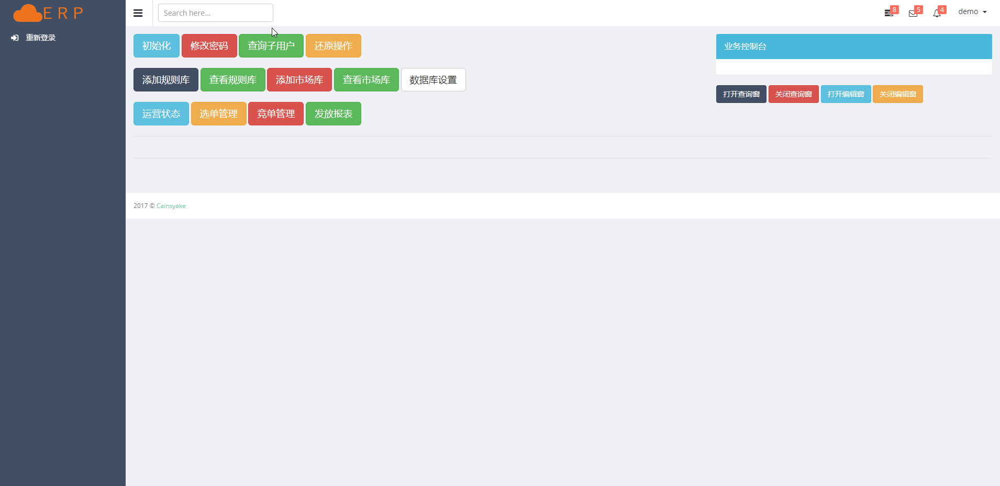 
要注意的是，初始化和还原教学班都是比较重要的操作，务必小心进行，一旦操作成功将覆盖或删除相关数据库信息 
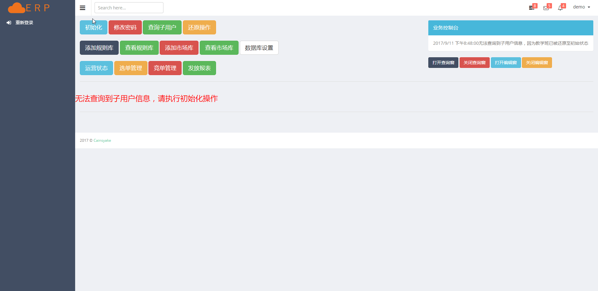 
操作区第二行按钮主要是对**规则和市场**进行操作，在这里就不再介绍了。  
操作区第三行按钮主要是对教学班进行**管控操作**，这里以**选单管理**做一个简单的介绍。 
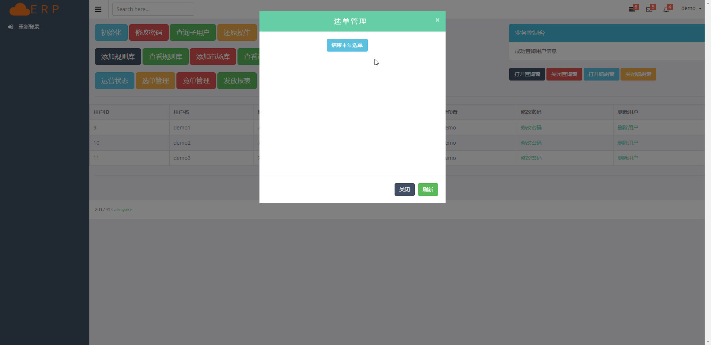 
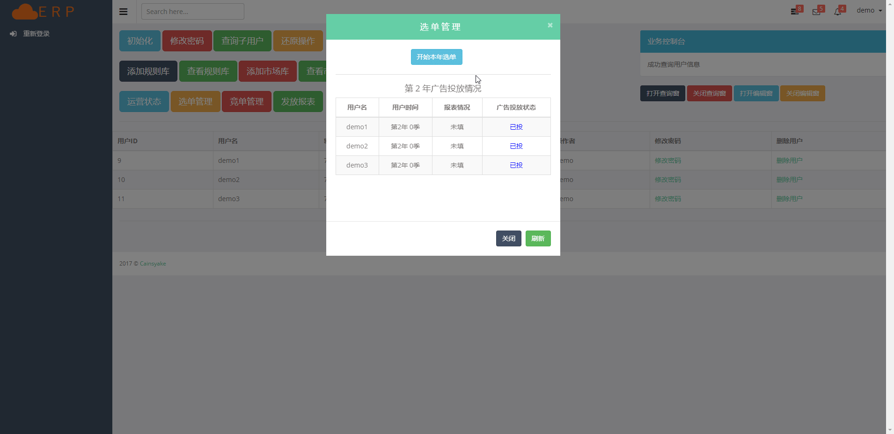 
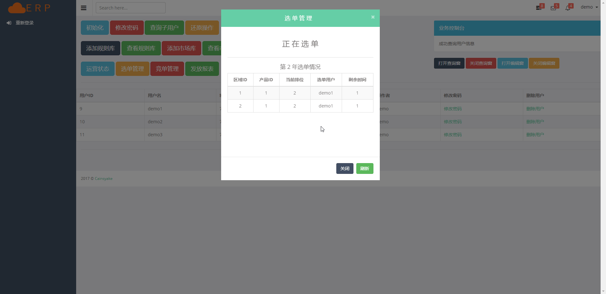 
对于教师端的介绍暂时到此为止，接下来的开发主要也是围绕**教师端的统计/分析业务**展开。  

最后我们来登录一个**学生**账号 
页面的左上方是操作区， 
操作区第一行按钮（也就是较大的按钮）是根据**用户运营阶段不同**而动态显示的**可进行操作**。 
操作区第二行按钮（也就是较小的按钮）是用户在**任何运营阶段**均可进行的**运营操作**。 
我们可以看一下从当年开始到第一季结束这个阶段的几个关键操作。 
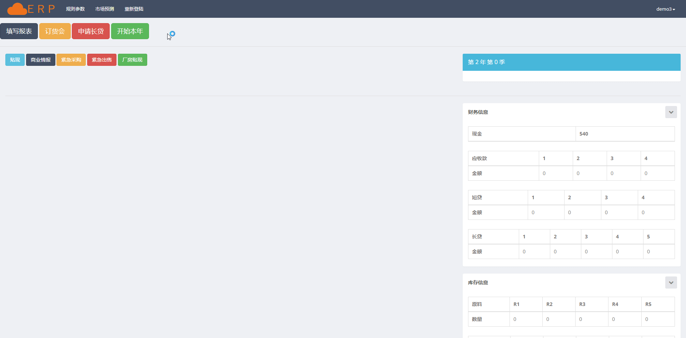  
以申请短贷为例，这是一个相对简单的业务，输入贷款额后点击申请按钮即可向服务器后台发送请求。 
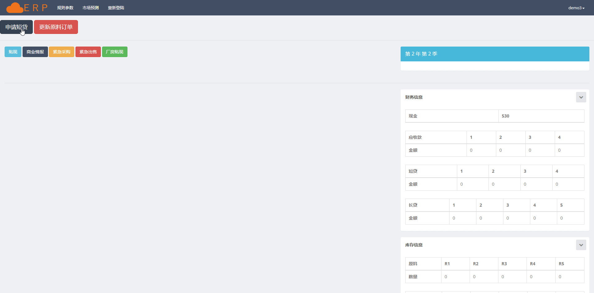  
每进行一次业务操作，都会从服务器读取最新的运营状态，并显示在页面相应区域。 
下面我们将通过进行厂房的租赁操作和生产线的新建操作来展示页面的更新。 
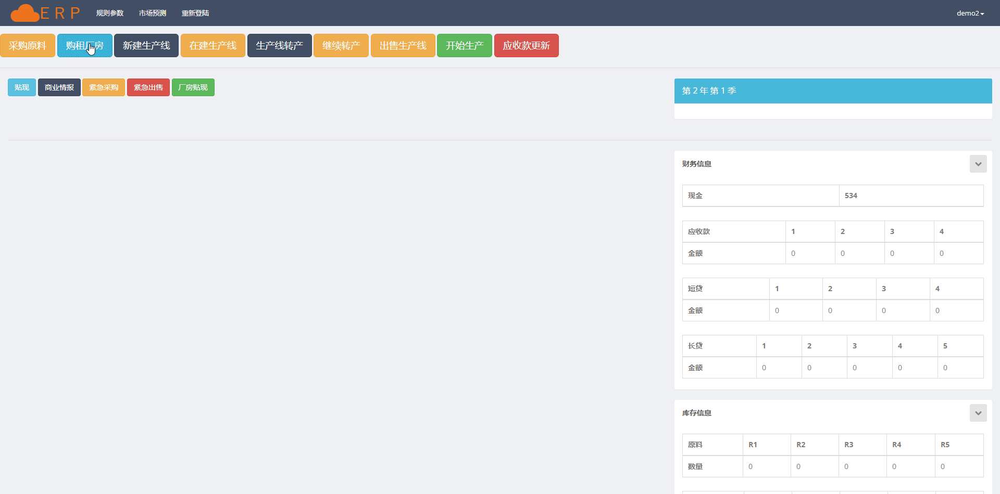  
最后我们看看初步版本的选单界面。
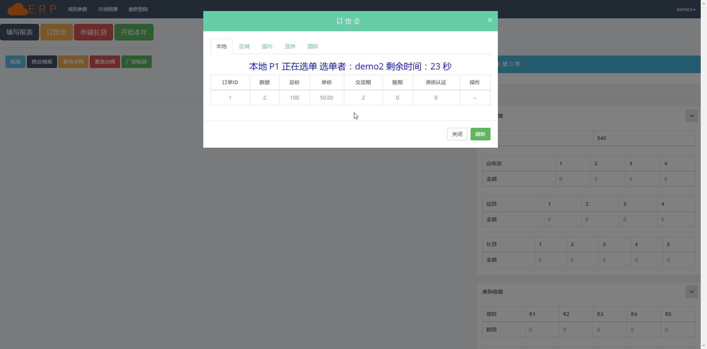  

由于时间有限，目前只实现了大部分高频业务的处理，部分低频业务暂未完成开发； 
前端部分目前目标为可用即可，因为尚未作太多优化，请见谅。  

