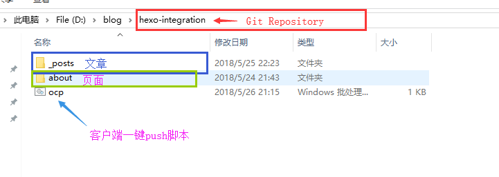
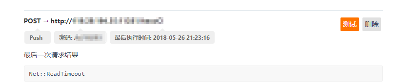
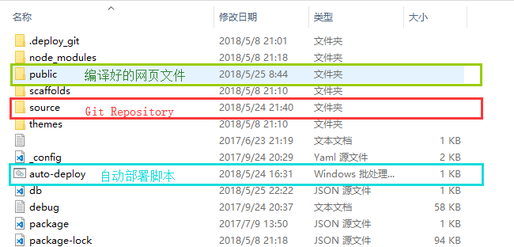
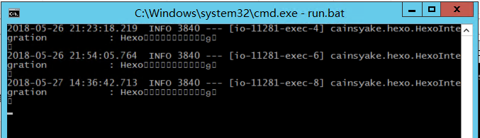
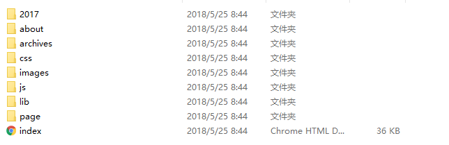
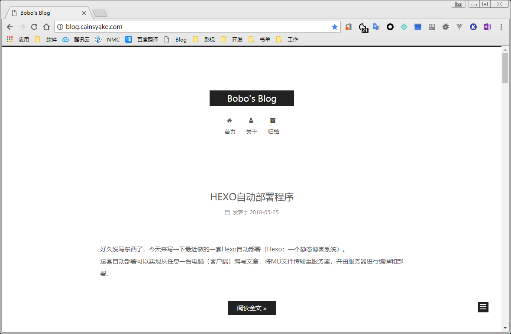

好久没写东西了，今天来写一下最近做的一套Hexo自动部署（Hexo：一个静态博客系统）。
这套自动部署可以实现从任意一台电脑（客户端）编写文章，将MD文件传输至服务器，并由服务器进行编译和部署。
<!-- more -->
这套Hexo的自动部署，我计划是分初期和中远期实现的。<br>
初期实现
---
先说大概处理流程: **客户端在Git仓库目录中新建md文件** -> **push commit到远程仓库** -> **码云(Gitee)触发WebHook** -> **服务器监听程序接收请求** -> **启动自动部署**
客户端用Git Repository存放Hexo的文章以及页面文件，这些文件都是Markdown格式，同时为了便于在文章中插入图片，图片文件也是存放在Git仓库中的。<br>
Git Repostitory结构如图1<br>
<br>
写编辑完文章的md文件后，启动ocp脚本，即可一键讲当前Git Repository推送至远程仓库。ocp脚本内容如下：
``` cmd
@echo off
call git add -A
call git commit -m "ocp"
call git push
```
我在码云上面的仓库设置了WebHook（码云钩子功能（callback），用户 push 了代码后，自动向一个设定的 http 地址发出请求。）至于这个设定的http地址稍后就会提到。
<br>

同时，我在服务器上面也搭建了一套Hexo的环境（[Hexo搭建过程看这里](http://blog.cainsyake.com/2017/07/09/Win10%E4%B8%8B%E6%90%AD%E5%BB%BAHexo/)），并将存放文章和页面的Git仓库clone到hexo下的source目录下，这样就通过Git将客户端与服务器上的md文件建立了联系。
在服务器的hexo目录下执行git clone命令:
```bash
$ git clone http://github.com/cainsyake/myhexo.git source
```
<br>
上图为服务器上的hexo目录结构。<br>

为了监听Gitee WebHook发出的http请求，我用Springboot搭建了一个简单的Web程序：**hexo-integration**。<br>
hexo-integration在接收到WebHook的请求后，会调用hexo目录下的 **auto-deploy** 自动部署脚本。<br>
auto-deploy的内容如下：<br>
```cmd
@echo off
call cd source
call git pull origin master:master
call cd ..
call hexo clean
call hexo g
exit
```
脚本的主要执行流程：**进入source文件夹**（文章和页面的Git仓库）-> **从远程仓库拉取更新** -> **返回hexo** -> **清理hexo已编译文件** -> **hexo重新编译** -> **执行完成退出**<br>
<br>
上图是服务器上的hexo-integration程序执行完自动部署后的日志。（由于CMD编码不是UTF-8导致中文显示不出来）<br>

由Hexo编译好的网页文件会出现在hexo/public目录下：
<br>

最后，利用Nginx中配置一个静态网页，将[blog.cainsyake.com](http://blog.cainsyake.com/)指向hexo/public/即可。<br>
nginx的配置：
```nginx
    server{
        listen 80;                                    
        server_name  blog.cainsyake.com;
        location / {
            root D:/hexo/public;
            index index.html;
        }
        error_page   500 502 503 504 /50x.html;
        location = /50x.html {
            root   /root;
        } 
    }
```

访问[blog.cainsyake.com](http://blog.cainsyake.com/)！
<br><br>

中远期实现
---
扩展hexo-integration，预期目标：为用户提供更流畅的博客上传、部署体验。<br>
主要功能：
1. 直接向服务器提交 文章/页面的md文件，触发自动部署。<br>
2. 直接在hexo-integration提供的在线编辑器上编辑文章/页面，随后自动部署。<br>
3. 管理历史文章，如修改、删除等。<br><br>

为了实现上述目标功能，需要：
* 提供md文件上传接口
* 提供Markdown在线编辑器
* 提供文章数据存储

<br>
另外，为了提高部署效率，在未来的设计中将不再支持 **图片文件** 与 **文章** 一同上传至服务器，如果要在文章中插入图片可以使用url形式插入；同时，为了便于用户进行图片的在线调用，我会在另一个项目**incloud**（开发中）提供图床功能。当然，用户也可以选择其他图床进行图片的存储及调用。<br><br>

未完待续。<br>