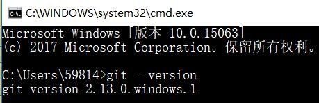
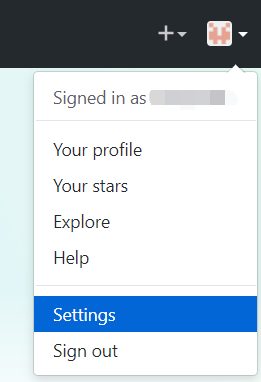
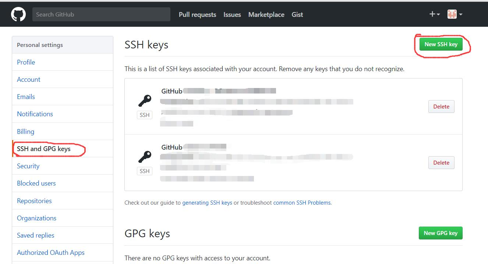
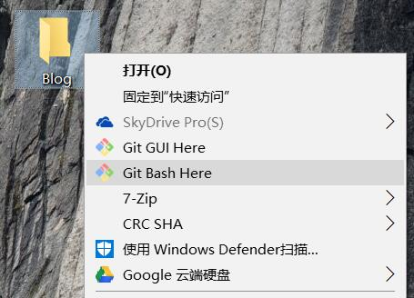
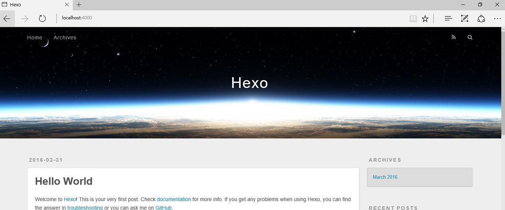
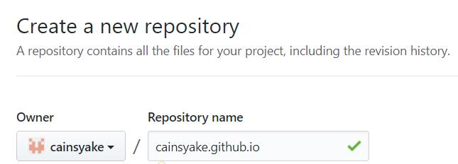
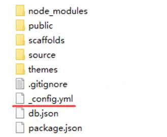
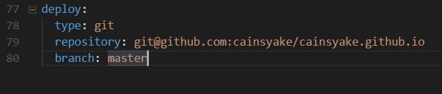
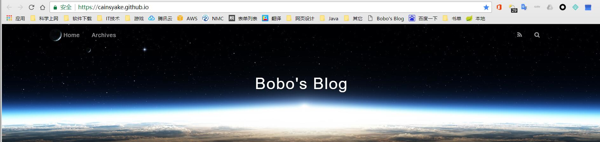

第一部分，本地环境搭建
首先安装**Node.js**,我安装的是6.11.0
Node的下载安装直接去[官网](https://nodejs.org/en/)就可以了。
然后还需要安装**git**,同样的在[官网](https://git-scm.com/)下载安装，在安装git的过程中我参考了[WX_JIN的安装记录](http://blog.csdn.net/wx_jin/article/details/51027783)。
网上大多数Hexo都是和Github page一起搭建，因此还需要一个[github](https://github.com/)账号。
<!--more-->
安装后上面两个软件后，直接在CMD中输入
```cmd
node -v
git --version
```
我的系统环境是win10。
第一部分，本地环境搭建
首先安装**Node.js**,我安装的是6.11.0
Node的下载安装直接去[官网](https://nodejs.org/en/)就可以了。
然后还需要安装**git**,同样的在[官网](https://git-scm.com/)下载安装，在安装git的过程中我参考了[WX_JIN的安装记录](http://blog.csdn.net/wx_jin/article/details/51027783)。
网上大多数Hexo都是和Github page一起搭建，因此还需要一个[github](https://github.com/)账号。
安装后上面两个软件后，直接在CMD中输入
```
> node -v
> git --version
```
两个命令分别是查看node的版本及git的版本，以查看**Node.js**和**Git**是否安装完成。



安装好Git后，需要配置用户名和邮箱。
在Git Bash中执行:
```
$ git config --global user.name "youname"
$ git config --global user.email "youeamil@email.com"
```
把双引号里面的内容替换成自己的用户名和邮箱即可。


电脑第一次使用git，需要生成SSH Key
在Git Bash中执行代码
```
$ ssh-keygen -t rsa -C "XXX@XXX.com"
```
这里的XXX换成自己的邮箱。
生成SSH Key后将其添加到github的SSH Key中，方法是在github点击右上角的头像，选择Settings-> SSH and GPG keys -> New SSH key。




完成上面的准备步骤后，即可开始安装**hexo**
在本地新建一个目录Blog，以存放Hexo;创建完成后右键该目录，选择Git Bash Here。



进入Git Bash后
输入命令安装Hexo:
```
$ npm install -g hexo
```
安装完成后可以输入hexo 以测试Hexo安装是否完成
```
$ hexo 
```
接着要初始化Hexo
```git
$ hexo init hexo
```
初始化成功后可以看见 INFO Start blogging with Hexo!

进入Blog文件夹，发现多了一个hexo的文件夹;同样的，右键Git Bash Here。
安装依赖文件
```
$ npm install
```

部署形成文件
```
$ hexo generate
```
然后在本地运行Hexo服务
```
$ hexo server
```
此时用浏览器打开http://localhost:4000/
即可看到默认生成的博客页面。


第二部分，部署Hexo到github page
首先要配置Github page,登录Github,新建一个Repository,Repository name是 Github的用户名.github.io


然后需要将本地hexo项目上传至Gitgub。打开本地的hexo文件夹

config.yml是hexo的配置文件，要将hexo部署到Github page上，需要打开配置文件,对最后面的deploy属性进行编辑，加上几行代码：
```
$ type: git
$ repository: git@github.com:XXX/XXX.github.io.git
$  branch: master
```
其中repository是刚才在Github建的仓库的地址

在这个配置文件中还可以修改网站的一些信息，在这里就不一一细说了。

为了部署hexo到Github page上,还需要安装hexo-deployer-git插件
```
$ npm install hexo-deployer-git --save
```

最后，执行以下命令即可将hexo部署至Github page:
```
$ hexo clean
$ hexo generator
$ hexo deploy
```
其中，hexo generator可以替换成hexo g , hexo deploy可以替换成hexo d 。
访问自己的[Github page](https://cainsyake.github.io/)就可以看到部署成功的Hexo博客了。
