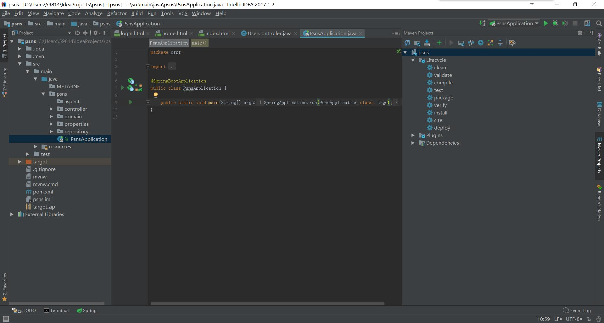
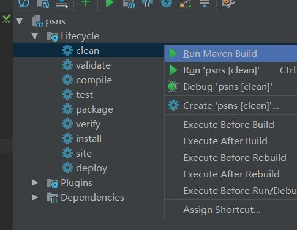
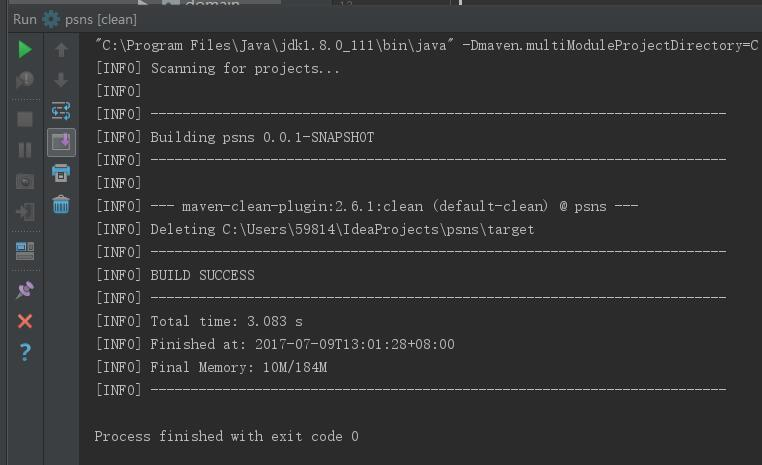
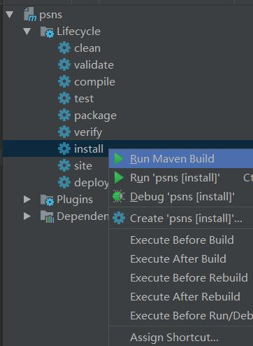
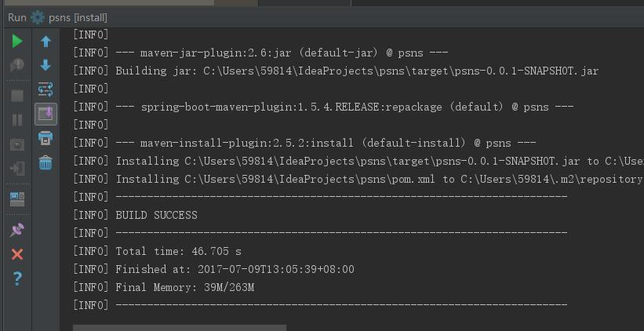
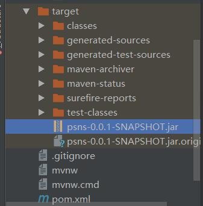
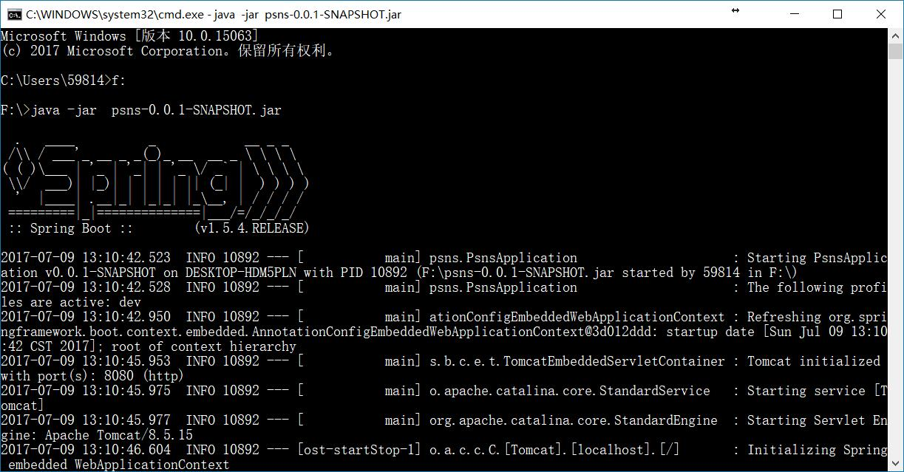
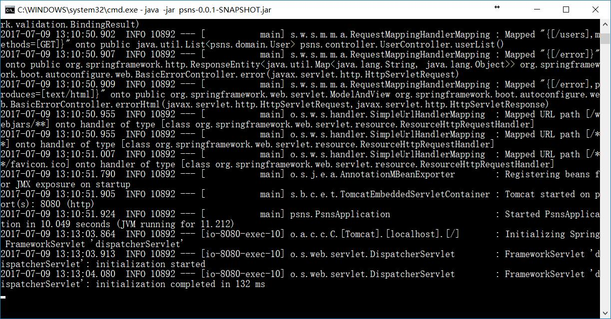
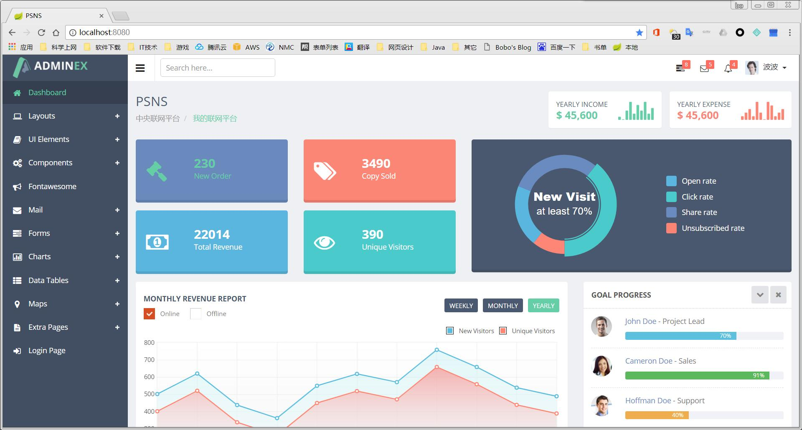

这个是一个利用Maven构建的**Springboot**项目，我用的**Idea17**。
本文主要讲的是如何利用Maven对项目进行打包，生成可执行的jar包，至于如何用Springboot进行开发，网上也有许多入门教程，改天我也会写一下我的Springboot学习记录。
<!-- more -->
首先要打开Maven Project工具栏，点击菜单栏中的**View**，在**Tool Windows**中找到**Maven Project**，点击后即可在右侧看到Maven Project工具栏。


在**Lifecycle-clean**处右键，点击Run Maven Build



然后选择**install**右键点击Run Maven Build


打包成功后即可在**target**目录下找到打包后的jar包

为了测试，我把jar包复制到F盘根目录下。并在CMD中运行
```
> java -jar psns-0.0.1-SNAPSHOT.jar
```

运行后，看到熟悉的Spring标志，就成功一半啦。
在日志中可以看到**Tomcat started on port(s):8080 (http)**
这表明该服务成功运行在8080端口上。

最后打开浏览器，访问http://localhost:8080

至此成功结束此次打包测试。
