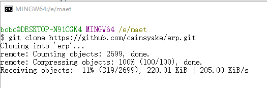
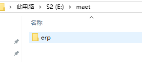
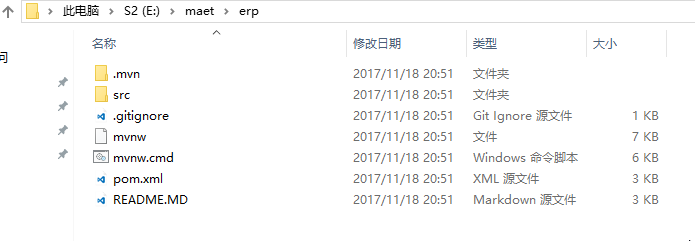
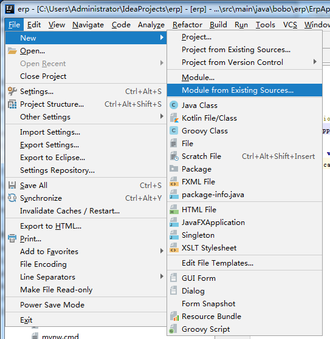
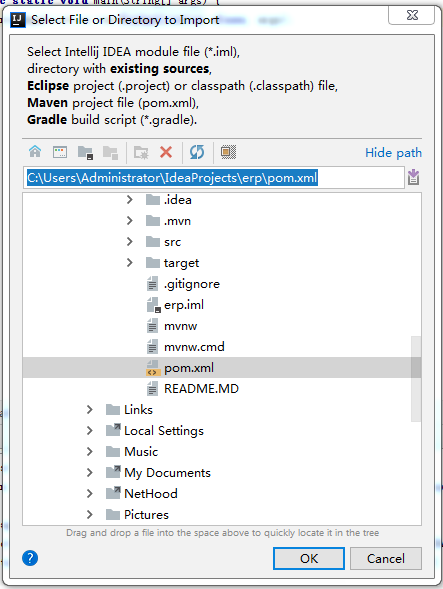
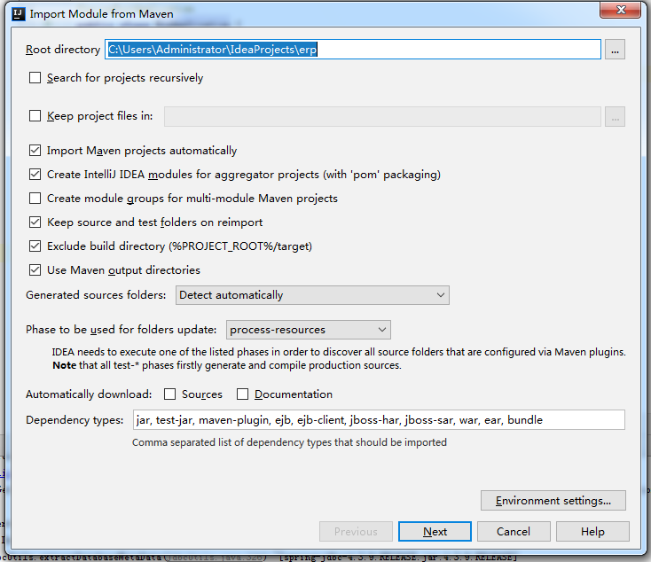
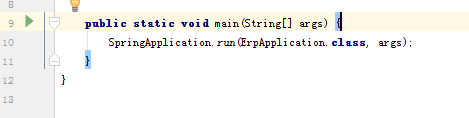
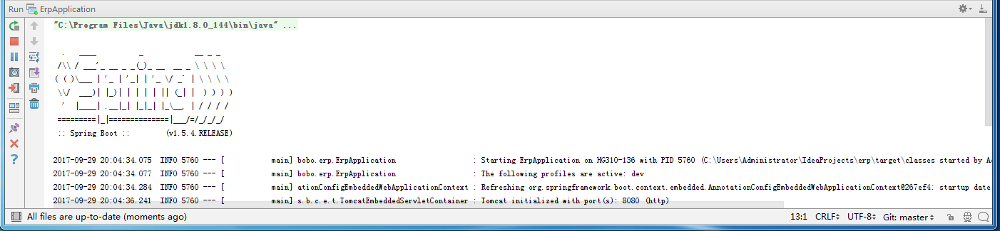

之前在实验室安装了IDEA的社区版，尝试编译运行一个Springboot的Maven项目。<br>
在安装好JDK,MySql，Git和IDEA2017后。<br>
此次以MAET-ERP为例，在E盘新建一个maet文件夹。<br>
<!-- more -->
<br>
在文件夹中点击右键，选择Git Bash Here。
开始Clone源代码：
```
$ git clone https://github.com/cainsyake/erp.git
```
<br>
Clone完成后可以看到多了一个文件夹 "erp"。<br>
<br>
<br>
<br>
接着打开IDEA一个已有项目，点击菜单的“**File**”->“**new**”->“**Module from Existing Sources...**”。<br>
选择erp文件夹中的**pom.xml**，点击**OK**。<br>
<br>
<br>
<br>
配置完成后，找到**src**->**main**->**java**->**bobo**->**erp**->**ErpApplication.java**。<br>
<br>
点击左侧的**绿色箭头**运行服务端程序。<br>
<br>
<br>
由于时间原因，上面的步骤可能有所省略，下次更新会一步步地记录如何编译运行。<br><br>
**[返回 MAET-ERP WIKI](https://github.com/cainsyake/erp/wiki/%E6%BA%90%E7%A0%81%E7%89%88%E6%9C%8D%E5%8A%A1%E7%AB%AF%E5%AE%89%E8%A3%85%E6%95%99%E7%A8%8B)**
